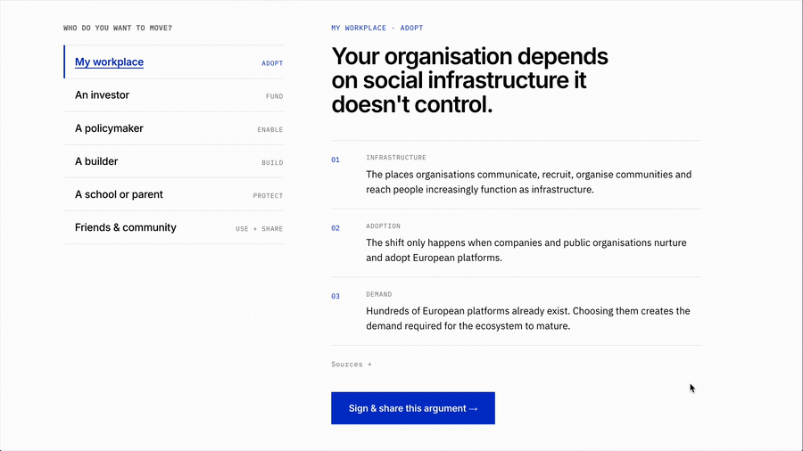
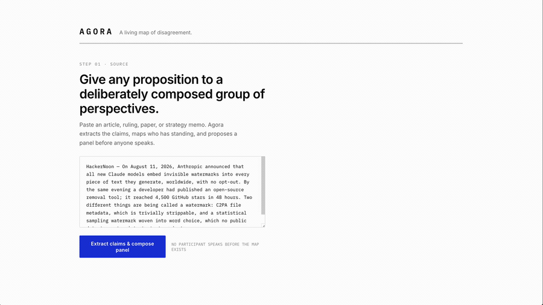
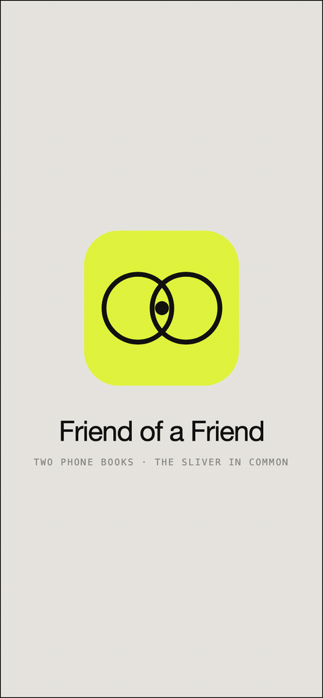
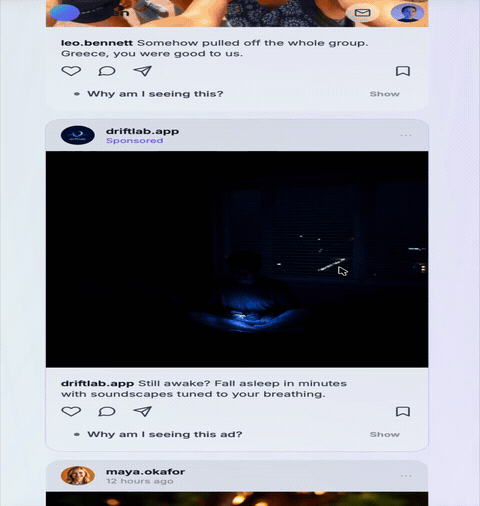
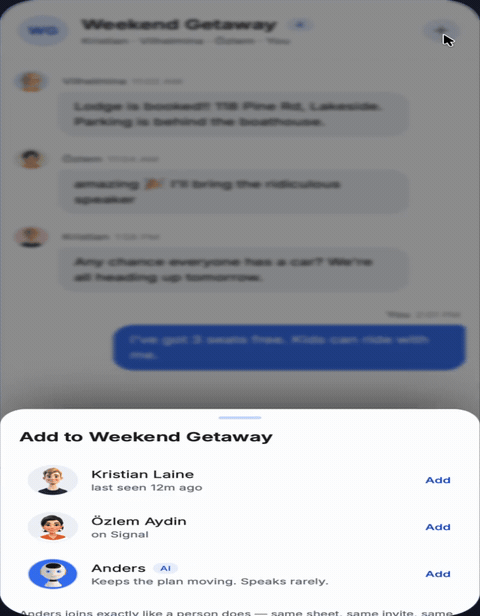

# Rebuild 2 Prototypes

A collection of the public prototypes built during 48 hours for European social platforms at Rebuild 2 in Helsinki, August 30th–September 1st, 2026.

---

## The Rebuild Letter

TODO_LIVE_PREVIEW

*TODO_TAGLINE*

TODO_DESCRIPTION

TODO_GITHUB_REPO

---

## Agora

TODO_LIVE_PREVIEW

*TODO_TAGLINE*

TODO_DESCRIPTION

TODO_GITHUB_REPO

---

## Friend of a Friend

TODO_LIVE_PREVIEW

*TODO_TAGLINE*

TODO_DESCRIPTION

TODO_GITHUB_REPO

---

## Open

[Live preview](https://rebuild2-open-algorithm.lovable.app)

*Every post tells you why you're seeing it.*

Open is a prototype social feed that treats algorithmic transparency as a design feature: every post — from an old friend's wedding photo to a paid ad or a public voting reminder — carries an expandable "Why am I seeing this?" explanation showing the signals, data, and economics that put it there. Users can also open "Adjust what you see" to compose their own feed stack, adding single-purpose feeds and filters on top of a strong default baseline, so the system feels legible and controllable rather than opaque and infinite.

TODO_GITHUB_REPO

---

## Anders

[Live preview](https://rebuild2-agent-for-groups.lovable.app)

*Add an AI to the group chat the way you'd add a friend.*

Anders is a prototype of an AI agent you add to a group chat exactly like a new friend — same invite sheet, same member list — then give a lightweight role such as logistics, bumping unanswered questions, or resurfacing buried details. Once added, Anders reads the room: it nudges the group when a key question is ignored, pulls up an address from deep in the thread when someone is on their way, and only pings when the moment actually matters, staying quiet at night and matching the group's language without being annoying.

TODO_GITHUB_REPO

---

## Writ

TODO_LIVE_PREVIEW

*TODO_TAGLINE*

TODO_DESCRIPTION

TODO_GITHUB_REPO
